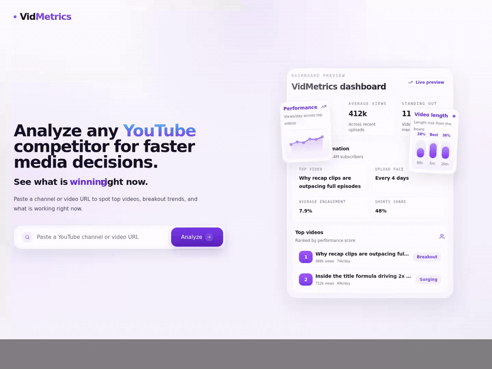

# VidMetrics

<p>
  VidMetrics is a YouTube competitor analysis app that turns a public channel or video URL into a focused research dashboard with rankings, charts, repeated-topic signals, and exportable results.
</p>

<p>
  
</p>

<p>
  <a href="./docs/build-notes.md"><strong>Detailed build notes</strong></a>
</p>

<p>
  
  
  
  
  
  
</p>

## What It Does

- Accepts YouTube channel URLs, video URLs, Shorts URLs, and `youtu.be` links
- Resolves video URLs back to their parent channel before analysis
- Analyzes `25`, `50`, `100`, or all recent uploads
- Supports `All`, `Shorts`, and `Long video` views
- Shows channel summary metrics, top videos, content analysis, keyword analysis, charts, and CSV export

## Setup Instructions

### Requirements

- Node.js `20+`
- npm
- Optional: a YouTube Data API v3 key for live data

### Run Locally

```bash
npm install
cp .env.example .env.local
npm run dev
```

Open `http://127.0.0.1:3000`.

## Environment Variables

```bash
NEXT_PUBLIC_APP_NAME=VidMetrics
NEXT_PUBLIC_BASE_URL=http://localhost:3000
NEXT_PUBLIC_DEFAULT_WINDOW_DAYS=30
YOUTUBE_API_KEY=your_youtube_data_api_key
```

If `YOUTUBE_API_KEY` is not set, the app falls back to local demo data so the interface is still reviewable.

## How I Approached The Build

- Kept the product to two clear surfaces: a landing page and a dedicated analysis workspace
- Used only public YouTube data so the app works without channel-owner access
- Treated `views/day`, engagement, and recency as more useful competitor signals than raw views alone
- Kept section-level controls where comparison matters, but anchored them to the main board mode for consistency
- Chose a dashboard-first layout over multi-page navigation so the product stays fast to scan and demo

## Metrics Used

- `Average views`: average total views across the analyzed videos for the selected board mode
- `Average views/day`: average daily pace across the analyzed videos for the selected board mode
- `Average engagement`: `(likes + comments) / views * 100` across the analyzed videos
- `Upload pace`: average gap in days between analyzed uploads
- `Standing out here`: count of analyzed videos that are clearly above the board median for views or views/day
- `Score`: weighted internal ranking signal using views/day, engagement rate, total views, and recency
- `Breakout / Surging / High engagement / Steady`: relative product labels based on the analyzed board, not official YouTube metrics

## Scripts

- `npm run dev` starts the local dev server
- `npm run lint` runs ESLint
- `npm run build` creates a production build
- `npm run format` formats the repository with Prettier

## Project Structure

```text
docs/
  demo/
    vidmetrics-walkthrough.mp4

src/
  app/
    analyze/page.tsx
    api/analyze/route.ts
    icon.tsx
    layout.tsx
    page.tsx
    robots.ts
    sitemap.ts

  components/vidmetrics/
    landing-page.tsx
    vidmetrics-app.tsx
    performance-chart.tsx
    content-analysis.tsx
    keyword-analysis.tsx

  lib/
    analysis.ts
    mock-data.ts
    types.ts
    utils.ts
    youtube.ts
```

## Verification

- `npm run format`
- `npm run lint`
- `npm run build`
